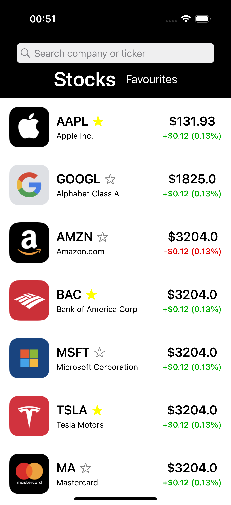
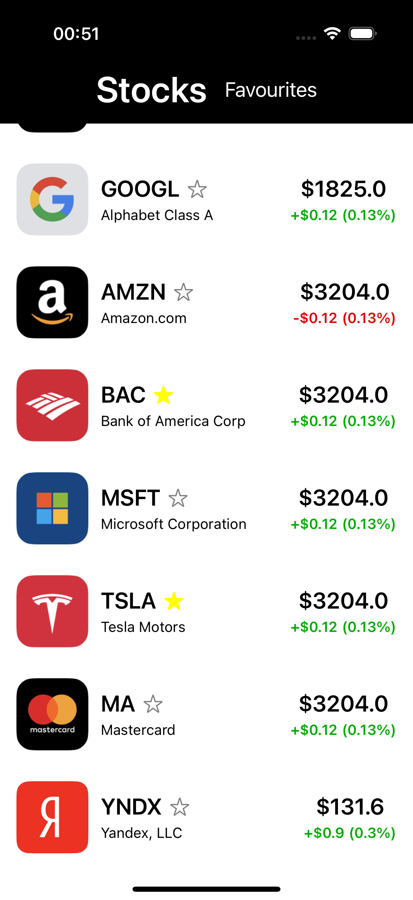

# Stock List

Список акций с поиском и избранным, а также сохранением состояния и оффлайн режимом

| Акции | Избранное | Скроллинг | Обновление |
|----------|-------|-------|-------------|
|  |  |  |  |

---

## Возможности

- Загрузка списка акций через API
- Поиск по названию компании и тикеру строку поиска
- Отображение избранных акций
- Переключение между вкладками «Stocks» и «Favourites»
- Offline-доступ при запуске без интернета
- Добавление в избранное с сохранением состояния
- Pull-to-refresh для обновления ленты
- Индикатор загрузки при старте

---

## Установка и запуск

Чтобы запустить приложение, выполните следующие шаги:

1.  Клонируйте репозиторий:
    ```sh
    git clone https://github.com/ShijaN03/stock-list
    ```
2.  Перейдите в директорию проекта и откройте .xcodeproj:
    ```sh
    cd stock-list
    open stock-list.xcodeproj
    ```
3.  Соберите и запустите приложение на симуляторе или реальном устройстве.

---

## Используемые технологии

- **Swift** — язык программирования
- **UIKit** — пользовательский интерфейс
- **Clean Swift** — архитектура проекта
- **Auto Layout** — адаптивная верстка
- **UITableView** — отображение ленты постов
- **URLSession** — сетевые запросы
- **UISearchBar** — поисковая строка
- **Core Data** — локальное хранилище и оффлайн-доступ
- **mustdev.ru** — источник моковых данных

---

## Автор

**Kirill Shiyan** – [GitHub](https://github.com/ShijaN03)
